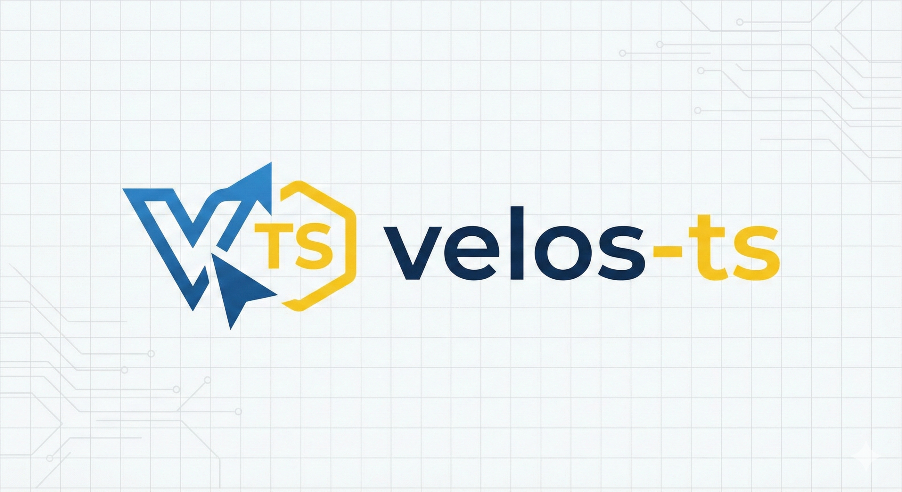

<p align="center">
  
</p>

<h1 align="center">Velos-TS</h1>

<p align="center">
  <strong>Generate type-safe TypeScript repositories from OpenAPI specifications</strong>
</p>

<p align="center">
  <a href="https://www.npmjs.com/package/velos-ts"></a>
  <a href="https://opensource.org/licenses/MIT"></a>
  <a href="https://nodejs.org/"></a>
  <a href="https://www.typescriptlang.org/"></a>
</p>

---

## Features

**Zero Manual Type Definitions** - All types derived from OpenAPI spec  
**Type-Safe API Interactions** - Full TypeScript type safety from request to response  
**Result Pattern** - Predictable error handling without exceptions  
**Automated Boilerplate** - Generates repositories, interfaces, and type aliases  
**Simple Integration** - Works as a dev dependency in any TypeScript project  
**Beautiful CLI** - Intuitive commands with helpful output  
**Highly Configurable** - YAML-based configuration with smart defaults

## Quick Start

### Installation

**From npm (recommended):**
```bash
npm install --save-dev velos-ts
```

**From GitHub:**
```bash
# Latest from main branch
npm install --save-dev git+https://github.com/khyarih/velos-ts.git

# Specific branch
npm install --save-dev git+https://github.com/khyarih/velos-ts.git#branch-name

# Specific tag/release
npm install --save-dev git+https://github.com/khyarih/velos-ts.git#v1.0.0
```

### Initialize Configuration

```bash
npx velos init
```

This creates a `velos.config.yaml` file:

```yaml
openApiSpecPath: ./api-docs.json
outputDir: ./src/generated/repositories
apiSpecTypesPath: '@/api/api-spec'

includePatterns:
  - /api/v1/**

excludePatterns:
  - /api/v1/admin/**
```

### Generate Repositories

```bash
npx velos generate
```

### Use Generated Repositories

```typescript
import { FetchApiClient } from 'velos-ts/runtime';
import { ProductRepository } from './generated/repositories';

// Create API client
const apiClient = new FetchApiClient({
  baseUrl: 'https://api.example.com',
  auth: () => getAuthToken(),
});

// Create repository
const productRepo = new ProductRepository(apiClient);

// Use repository (fully typed!)
const result = await productRepo.getProductById(123);

if (result.success) {
  console.log(result.data); // Type: ProductDTO
} else {
  console.error(result.error); // Type: ErrorDetails
}
```

## Examples

Comprehensive examples for common use cases:

### 🍪 [Server-Side Cookie Authentication](./examples/server-side-cookies-auth.ts)
Complete guide for HTTP-only cookie authentication with CSRF protection:
- Basic cookie authentication setup
- CSRF token handling with interceptors
- Session expiry and error handling
- React integration example
- Backend configuration requirements

### 📚 [More Examples](./examples/)
Visit the [examples directory](./examples/) for more practical implementations.

## How It Works

```
┌─────────────────────┐
│ OpenAPI Spec        │
│ (JSON/YAML)         │
└──────────┬──────────┘
           │
           ▼
┌─────────────────────┐
│ openapi-typescript  │
│ (generates types)   │
└──────────┬──────────┘
           │
           ▼
┌─────────────────────┐
│ velos-ts             │
│ (generates repos)   │
└──────────┬──────────┘
           │
           ▼
┌─────────────────────┐
│ Type-Safe           │
│ Repositories        │
└─────────────────────┘
```

## CLI Commands

### `velos generate`

Generate repositories from OpenAPI specification.

```bash
# Basic usage
velos generate

# With custom config
velos generate --config ./my-config.yaml

# Override config options
velos generate --spec ./api-docs.json --output ./src/repos --overwrite

# Filter endpoints
velos generate --include "/api/v1/**" --exclude "/api/v1/admin/**"

# Preview without writing
velos generate --dry-run
```

### `velos init`

Create a sample configuration file.

```bash
# Create default config
velos init

# Custom output path
velos init --output ./config/velos.yaml

# Overwrite existing
velos init --force
```

## Configuration

Configure via YAML file (recommended) or CLI arguments.

### Example Configuration

```yaml
# velos.config.yaml

# Path to OpenAPI specification
openApiSpecPath: ./api-docs.json

# Output directory for generated repositories
outputDir: ./src/generated/repositories

# Import path for openapi-typescript types
apiSpecTypesPath: '@/api/api-spec'

# Overwrite existing files
overwrite: true

# Endpoint patterns to include
includePatterns:
  - /api/v1/product**
  - /api/v1/category**
  - /api/v1/order**

# Endpoint patterns to exclude
excludePatterns:
  - /api/v1/admin/**
  - /api/v1/internal/**

# Code generation options
generateInterfaces: true
generateTypeAliases: true
generateJSDocs: true
```

See [Configuration Guide](./docs/CONFIGURATION.md) for all options.

## Pattern Matching

Endpoint patterns support wildcards:

- `*` - Matches single path segment
- `**` - Matches multiple path segments (recursive)

Examples:

```yaml
includePatterns:
  - /api/v1/product/**     # All product endpoints
  - /api/*/users           # Users in any version
  - /api/**/public/**      # All public endpoints

excludePatterns:
  - /api/v1/admin/**       # No admin endpoints
  - /**/__test__/**        # No test endpoints
```

## Generated Code

### Repository Interface

```typescript
export interface IProductRepository {
  getProductById(id: number, options?: RequestOptions): Promise<Result<ProductDTO>>;
  getAllProducts(queryParams?: GetAllProductsQueryParams, options?: RequestOptions): Promise<Result<Page<ProductDTO>>>;
  createProduct(data: CreateProductRequest, options?: RequestOptions): Promise<Result<ProductDTO>>;
  updateProduct(id: number, data: UpdateProductRequest, options?: RequestOptions): Promise<Result<ProductDTO>>;
  deleteProduct(id: number, options?: RequestOptions): Promise<Result<void>>;
}
```

### Repository Implementation

```typescript
export class ProductRepository extends BaseRepository<ProductDTO> implements IProductRepository {
  protected readonly endpoint = '/api/v1/product';

  constructor(apiClient: ApiClient) {
    super(apiClient);
  }

  async getProductById(id: number, options?: RequestOptions): Promise<Result<ProductDTO>> {
    try {
      const response = await this.apiClient.get<ProductDTO>(
        `${this.endpoint}/${id}`,
        undefined,
        {},
        options
      );
      return success(response);
    } catch (error) {
      return failure(errorToDetails(error, 'API_ERROR'));
    }
  }

  // ... more methods
}
```

## Runtime Dependencies

The generated repositories depend on runtime utilities provided by `velos`:

```typescript
import { BaseRepository, Result, FetchApiClient } from 'velos-ts/runtime';
```

These are included in the package, so users don't need to implement them.

## Integration with Build Tools

### package.json Scripts

```json
{
  "scripts": {
    "generate:types": "openapi-typescript ./api-docs.json -o ./src/api/api-spec.ts",
    "generate:repos": "velos generate",
    "generate": "npm run generate:types && npm run generate:repos",
    "predev": "npm run generate",
    "prebuild": "npm run generate"
  }
}
```

Now `npm run dev` and `npm run build` automatically regenerate repositories!

### CI/CD

```yaml
# .github/workflows/ci.yml
- name: Generate Repositories
  run: |
    npm install
    npm run generate

- name: Check TypeScript
  run: npm run type-check
```

## Requirements

- Node.js 18+
- TypeScript 5+
- openapi-typescript (peer dependency)

## Documentation

- [Configuration Guide](./docs/CONFIGURATION.md) - Complete configuration reference
- [CLI Reference](./docs/CLI.md) - All CLI commands and options

## Architecture

Built on a modular architecture with clear separation of concerns:

- **Core Runtime**: Result pattern, ApiClient, BaseRepository
- **Spec Loader**: Load and validate OpenAPI specs
- **Extractor**: Group operations by resource
- **Analyzer**: Analyze types and schemas
- **Generator**: Generate repository code
- **Config**: YAML-based configuration
- **CLI**: Beautiful command-line interface


## Advantages Over Alternatives

### vs. OpenAPI Generator (`@openapitools/openapi-generator-cli`)

| Feature | velos-ts | OpenAPI Generator |
|---------|---------|-------------------|
| **Dependencies** | Zero (just Node.js) | Java 11+ required |
| **Speed** | ⚡ Milliseconds | Seconds (JVM startup) |
| **Custom Patterns** | ✅ Result<T>, custom errors | ❌ Hard to customize |
| **Size** | < 1MB | Large (Java-based) |
| **TypeScript-first** | ✅ | Limited |

### vs. Manual API Clients

| Feature | velos-ts | Manual |
|---------|---------|--------|
| **Type Safety** | ✅ 100% from spec | ⚠️ Manual work |
| **Boilerplate** | ✅ Auto-generated | ❌ Repetitive |
| **Consistency** | ✅ Always consistent | ⚠️ Varies |
| **Maintenance** | ✅ Regenerate on spec change | ❌ Manual updates |

## Examples

See [example.ts](./example.ts) for complete usage examples.

## Troubleshooting

### Command Not Found

```bash
# Use npx
npx velos generate

# Or install globally
npm install -g velos-ts
```

### Configuration Not Found

```bash
# Create config file
velos init
```

### Spec Loading Failed

Check that:
1. File path is correct in config
2. File is valid JSON/YAML
3. File is valid OpenAPI 3.x spec

Validate at: https://editor.swagger.io/

## Contributing

Contributions are welcome! Please see [CONTRIBUTING.md](./CONTRIBUTING.md) for guidelines.

## License

MIT © [Hamza Khyari](https://github.com/khyarih)

## Acknowledgments

Built on top of:
- [openapi-typescript](https://github.com/drwpow/openapi-typescript) - TypeScript types from OpenAPI
- [Commander.js](https://github.com/tj/commander.js) - CLI framework
- [Zod](https://github.com/colinhacks/zod) - Schema validation

## Links

- [GitHub Repository](https://github.com/khyarih/velos-ts)
- [npm Package](https://www.npmjs.com/package/velos-ts)
- [Documentation](./docs/)
- [Changelog](./CHANGELOG.md)
- [Issues](https://github.com/khyarih/velos-ts/issues)
